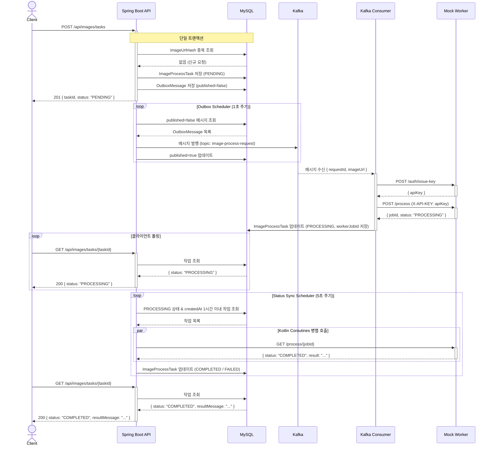
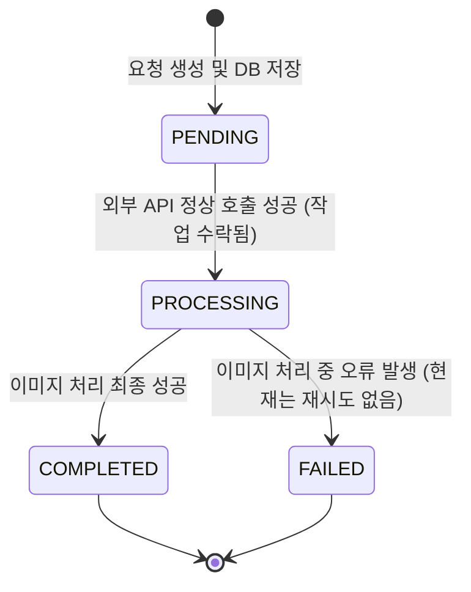

# Image Process Request Service

대용량 이미지를 대상으로 하는 AI 추론(딥러닝 모델)을 수행하며, GPU 리소스를 많이 소모하는 외부 이미지 처리 서비스(Mock Worker)로 이미지 처리 요청을 전달하고 작업 상태를 확인할 수 있는 데모 서비스입니다.  
기본 동작에 집중하기 위해 별도 인증 관련 로직을 구현하지 않아 사용자 구분 동작을 하지 않습니다.

---

<br>

## 📎 목차

- [기술 스택](#기술-스택)
- [실행 방법](#실행-방법)
- [기능 명세](#기능-명세)
- [아키텍처 설계 방식 및 이유](#아키텍처-설계-방식-및-이유)
- [이미치 처리 작업 상태 모델](#이미치-처리-작업-상태-모델)

---

<br>

## 📍기술 스택

| 영역 | 기술 |
|------|------|
| 언어 / 프레임워크 | Kotlin 2.2 + Spring Boot 4.0 |
| DB | MySQL 8 |
| 메시지 큐 | Apache Kafka (KRaft) |
| ORM | Spring Data JPA (Hibernate 7) |
| API 문서 | Springdoc OpenAPI 3 (Swagger UI) |
| 인프라 | Docker Compose |

---

<br>

## 📍실행 방법

```bash
# 인프라 및 애플리케이션 전체 실행 (최초 App 빌드 시 Gradle 의존성 다운로드로 인해 소요 시간이 길 수 있습니다.)
docker compose up -d

# 로컬 개발 (인프라만 실행 후 앱 별도 실행)
docker compose up -d mysql kafka kafka-ui
./gradlew bootRun
```

| 서비스 | 호스트 포트 | 설명 |
|--------|-----------|------|
| Spring Boot API | `8080` | REST API 및 Swagger UI |
| Swagger UI | `8080` | `localhost:8080/swagger-ui.html` |
| MySQL | `3306` | 애플리케이션 DB |
| Kafka | `9092` | 메시지 브로커 (KRaft, 외부 접속용) |
| Kafka UI | `8180` | Kafka 토픽/메시지 모니터링 |

---

<br>

## 📍기능 명세

### API 엔드포인트

#### 이미지 처리 요청
```
POST /api/images/tasks
Content-Type: application/json

{ "imageUrl": "https://example.com/photo.jpg" }
```
- **201**: 요청 접수 성공, 작업 ID와 초기 상태(`PENDING`) 반환
- **409**: 동일한 이미지 URL로 이미 요청된 경우 (중복 요청 거부)

#### 전체 작업 목록 조회
```
GET /api/images/tasks?page=0&size=10
```
- 생성 시각 내림차순 정렬, Pagination 지원

#### 단일 작업 상태 조회
```
GET /api/images/tasks/{taskId}
```
- **200**: 작업 상세 정보 반환
- **404**: 존재하지 않는 작업 ID

> 상세 내용은 Swagger 참고

### 스케줄러

| 스케줄러 | 주기 | 역할 |
|----------|------|------|
| Outbox Publisher | 1초 | `published=false` Outbox 메시지를 Kafka에 발행하고 `published=true`로 업데이트 |
| Status Sync | 5초 | `PROCESSING` 상태 작업을 Mock Worker API로 병렬 조회하여 최종 상태로 갱신 |

---

<br>

## 📍아키텍처 설계 방식 및 이유

### 전체 흐름 (시퀀스 다이어그램)
이미지 처리 요청부터 결과 반환까지의 전체 시퀀스

### Details
💡 **중복 요청 방지**  
-> 이미지 URL 해싱 값을 비교하여 중복 방지
- 의사 결정:
  - 처음에는 Client 에서 ID 값을 생성하여 payload 로 받아 해당 값의 중복 여부를 판단하고자 했지만, 서버 입장에서는 실질적으로 해당 작업이 동일한지를 알 수 없었습니다.
  - 따라서 서버에서 요청 데이터를 기반으로 비교하고자 이미지 URL 을 해싱(SHA-256)하여 DB에 저장하여 이미지 처리 요청 시 비교하는 방식을 적용하였습니다.
  - 그리고 해당 해시 값은 DB Table에서 `UNIQUE INDEX`가 설정되어 있어 데이터 무결성을 유지하도록 하였습니다.
- 추후 고려사항:
  - 동일 요청 건에 대해 무조건 막을 것인가?
    - 현재는 동일한 요청은 절대 받지 않는 방식이지만, 서비스 정책에 따라 재시도를 허용하는 방식 고려해야합니다.  
    - Request Payload 내에 `force=true` 같은 값을 받아 동일 요청도 강제로 허용하거나, 어느 시점 이후에 허용하는 방식을 적용할 수 있습니다.  
  - 트래픽 증가에 따른 대처 방안
    - DB 내 데이터 또는 Client 요청이 많아지면 DB 이중화, Partitioning, Sharding 적용을 고려해 볼 수 있습니다.
    - DB로의 부하는 치명적일 수 있으므로 Redis 분산 락을 활용하고 앞선 동일 요청 허용 정책 적용을 함께 고려하여 TTL을 설정하여 관리할 수 있습니다.
  - 별도 유저에 대한 구분 동작이 없으므로 추후에는 유저 ID를 포함하여 해싱이 필요합니다. 

💡 **외부 API 호출 방식**  
-> Kafka 메시징 기반 비동기 호출
- 의사 결정:
  - Mock Worker로의 이미지 처리 요청 시 결과를 즉시 반환 받는 구조가 아니어서 단순히 구현하면 트랜잭션 말미 또는 종료 이후 동기적 호출을 할 수 있지만, 외부 시스템의 상태와 빠른 응답 시간을 보장할 수 없기 때문에 비동기 호출이 필요합니다.
  - `@Async` 로 비동기 호출을 적용하면 서버 다운 및 재시작 시 요청이 유실될 가능성이 존재합니다. 대안으로는 스케줄러를 통해 PENDING 상태의 작업을 재시도할 수 있습니다.
  - 하지만 유실 작업의 재처리 로직은 복잡할 수 있고 배치 작업 실행에 적합한 Mock Worker API가 존재하지 않아 서버 재시작으로 인한 작업 유실을 근본적으로 방지 가능한 MessageQueue 기반의 비동기 처리를 고려했습니다.
  - 라우팅과 우선순위에 적합한 RabbitMQ 대신 파티션과 고처리량 및 스트리밍에 적합한 Kafka 를 도입함으로 추후 확장성(이벤트 소싱, CQRS 등)을 고려하였습니다.
  - 또한 Transactional Outbox 패턴을 적용함으로 이벤트 유실을 방지하였습니다.
- 추후 고려사항:
  - 트래픽 증가에 따른 대처 방안
    - 현재 스케줄러로 폴링 방식의 Outbox 패턴을 적용하였기 때문에 인스턴스가 늘어날 경우 중복 발행 방지를 위한 DB lock 적용 또는 CDC 기반으로 실시간성을 높일 수 있습니다.
    - 또한 단일 스레드와 1초 주기로 전체 미발행 메시지를 처리하기 때문에 메시지 적체 시 지연이 발생할 수 있으므로 배치 크기 제한, 스케줄러 전담 인스턴스 분리를 고려해야 합니다.
  - Kafka 파티션 수와 컨슈머 수 그리고 리밸런싱에 대한 전략이 필요합니다. 

💡 **작업 상태 조회 및 업데이트**  
-> Client가 직접 상태를 확인하는 short polling 방식 & 스케줄러를 통한 Mock Worker로의 상태 요청 및 업데이트 진행
- 의사 결정:
  - 기본적으로 구현 복잡도를 낮추기 위해 폴링 방식을 채택하였습니다.
  - Mock Worker 에는 여러 작업의 상태를 한번에 조회할 수 있는 API가 부재합니다. 따라서 서버의 스레드 점유를 줄이기 위해 코루틴을 적용하여 병렬 처리를 하였습니다.
- 추후 고려사항(트래픽 증가에 따른 대처 방안):
  - Client의 많은 상태 조회 요청이 예상된다면 SSE, 짧은 TTL의 캐싱 또는 CQRS 도입을 검토해 볼 수 있습니다.
  - Mock Worker 시스템의 장애 또는 많은 호출로 인한 요청 제한을 방지하기 위해 Semaphore 와 처리율 제한 또는 Circuit Breaker 도입을 고려할 수 있습니다.
  - 작업 수 증가 시 DB 쿼리 부담 및 Coroutine 수가 폭증할 수 있습니다. 따라서 배치 크기 제한, 폴링 대신 Webhook 방식으로 전환을 검토해야 합니다.

### 실패 처리 전략
💡 **Kafka 발행 실패 (Transactional Outbox 패턴)**
- API 요청 수신 시 Kafka를 직접 호출하지 않고, 같은 트랜잭션 내에 `OutboxMessage`를 DB에 저장합니다. Kafka 발행은 이후 스케줄러가 담당하므로:
  - API 응답 직전 Kafka 브로커 장애가 발생해도 메시지 유실이 없습니다.
  - 애플리케이션이 재시작되어도 `published=false` 메시지가 DB에 남아 있어 스케줄러가 재시도합니다.
  - DB 트랜잭션 롤백 시 Outbox 레코드도 함께 롤백되어 유령 메시지 발행을 방지합니다.

💡 **Mock Worker API 호출 실패**
- `ImageProcessKafkaConsumer`는 `processRequest()` 호출 실패를 `try/catch`로 감싸 예외를 로깅하고 Consumer를 중단시키지 않습니다. 해당 메시지는 현재 별도 재처리 큐(DLT) 없이 단순 로깅으로만 처리됩니다.
- 프로덕션 환경에서는 Kafka Dead Letter Topic(DLT) 또는 재시도 큐를 도입하여 실패 메시지를 영속적으로 보관하고 재처리할 수 있어야 합니다.

💡 **Status Sync 중 조회 실패**
- `syncProcessingTaskStatuses()`의 Coroutine 블록 내에서 개별 작업의 상태 조회가 실패하더라도 `null`을 반환하고 `filterNotNull()`로 제외하여 나머지 작업의 정상 업데이트를 보장합니다.

💡 **PROCESSING 무한 대기 방지**
- `createdAt`이 현재 시각 기준 1시간 이내인 작업만 상태 동기화 대상으로 포함합니다. 1시간이 초과된 작업은 조회 대상에서 제외되어 스케줄러 부하를 방지합니다.
- 장기 미완료 작업의 자동 `FAILED` 전환은 현재 미구현 상태이며, 별도 만료 처리 스케줄러 추가를 고려할 수 있습니다.

### 패키지 구조

```
imageprocessrequestservice/
├── controller/    REST API 진입점
├── service/       핵심 비즈니스 로직 (요청 접수, 조회, 상태 동기화)
├── message/       Kafka 연동 (Consumer, Outbox 저장)
├── client/        외부 HTTP 클라이언트 (Mock Worker API)
├── scheduler/     주기 실행 작업
├── domain/        JPA 엔티티 및 상태 전이 메서드
├── repository/    Spring Data JPA 인터페이스
├── dto/           요청/응답 DTO
├── config/        인프라 설정 (Kafka, RestClient, Swagger)
└── util/          범용 유틸리티 (HashEncoder)
```

---

<br>

## 📍이미치 처리 작업 상태 모델



| 상태 | 설명                                                    |
|------|-------------------------------------------------------|
| `PENDING` | 현재 서버로 요청이 정상 전달되었으나 아직 Mock Worker로의 작업이 전달되지 않은 상태. |
| `PROCESSING` | Mock Worker에 작업 위임 완료, 결과 폴링 대기                       |
| `COMPLETED` | 이미지 처리 성공, 결과 메시지 저장                                  |
| `FAILED` | Mock Worker 의 이미지 처리 실패                               |

**'At-Least-Once'** 상태 모델을 의도하였습니다.  
실패한 건에 대해선 무의미한 재요청을 하지 않고 서버 및 외부 시스템의 부하를 최소화합니다. 그리고 외부 시스템의 오류 발생에도 작업이 유실되지 않고 PENDING 상태로 두어 추후 유연한 재처리 가능성을 염두하였습니다.   
현재에는 구현하지 않았지만, 장애 발생 시 알림과 수동 또는 지수 백오프를 통한 자동 재시도 정책을 추가하는 방식으로 고도화할 수 있습니다. 

<br><br>
